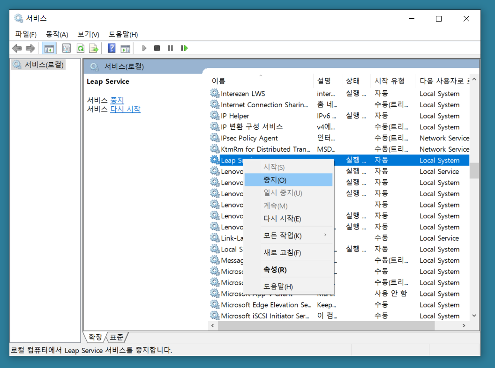
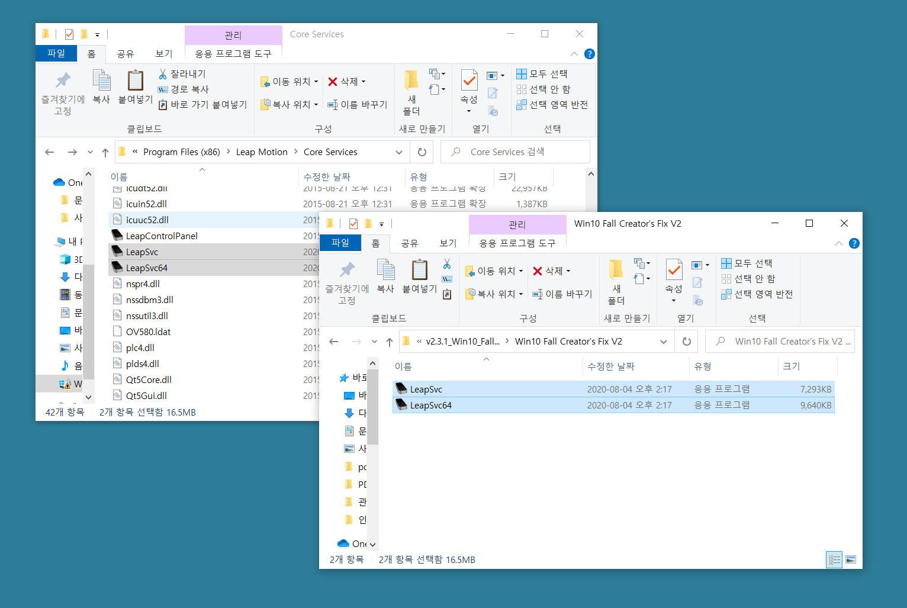
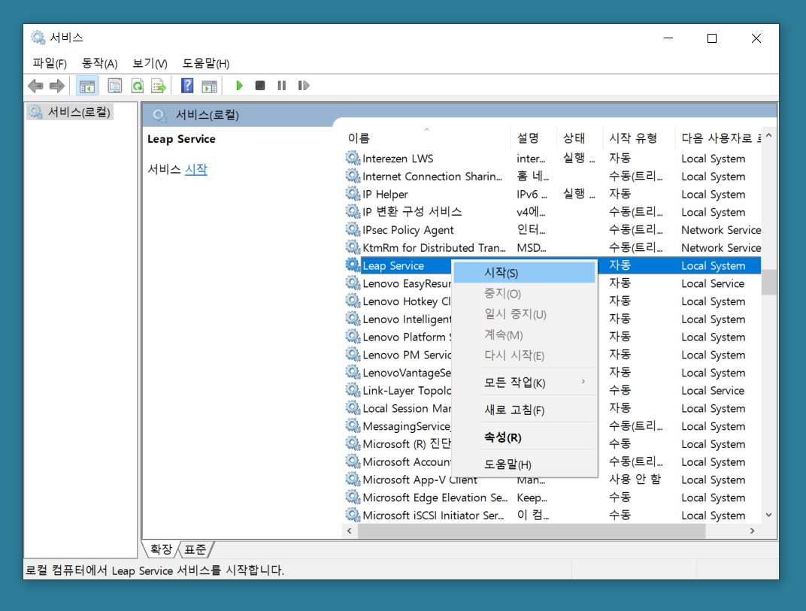

# Leap Motion Troubleshooting for Win 10

> 윈도 10 환경에서 Leap Motion이 제대로 인식되지 않는 문제에 대한 해결방법입니다. 원문은 https://forums.leapmotion.com/t/resolved-windows-10-fall-creators-update-bugfix/6585 에서 확인 가능합니다.

2017년 가을 시행된 윈도 10 업데이트로 인해, 윈도 10에서 이미지 디바이스를 처리하는 방법이 조금 바뀌었다고 합니다. 따라서 Leap Motion을 윈도 10에서 사용할 때 일부 버그가 발생하는 문제가 있다고 합니다.

이 프로젝트의 경우 V2를 사용하고 있기 때문에 Leap Motion에서 올려놓은 hotfix 파일을 받아 교체하면 됩니다.

0. `제어판` > `서비스` 에서 `LeapService` 항목을 사용 중지합니다.

    

1. 아래 링크로 가서 v2.3.1에 대한 hotfix 실행파일을 받습니다.

    [링크: v2.3.1_Win10_FallCreator_hotfix.zip](https://lm-public.s3.amazonaws.com/cs-resources/v2.3.1_Win10_FallCreator_hotfix.zip)

2. Leap Motion Core Services 폴더에 있는 원래 파일을 백업해놓은 뒤, 받은 실행파일 `LeapSvc.exe`와 `LeapSvc64.exe`를 교체합니다. (기본값은 `C:\Program Files(x86)\Leap Motion\Core Services` 입니다.)

    

3. `제어판` > `서비스` 에서 `LeapService` 항목을 다시 시작합니다.

    